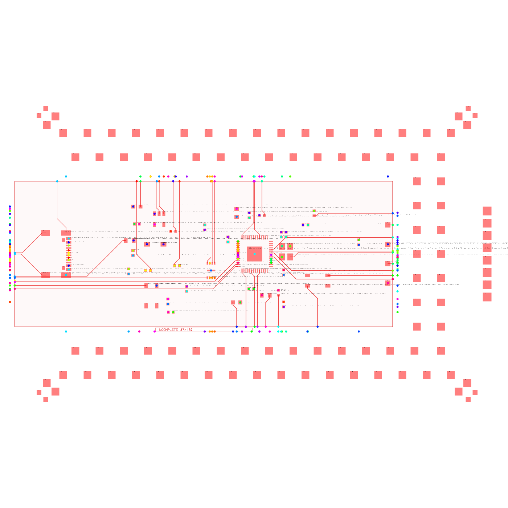

# @tscircuit/fanout-solver

BGA fanout preprocessor for
[`SimpleRouteJson`](https://github.com/tscircuit/tscircuit-autorouter).

`FanoutSolver` routes every connected package pad to one shared breakout boundary
before the general-purpose autorouter runs. It can put a small escape via in a
pad-to-pad channel or move an oversized via diagonally into the interstice
between four pad corners. It routes every member of a bus in the same direction
and treats each bus-layer decision atomically.

## Behavior

- Uses `SimpleRouteJson.buses` when present. It also understands a point
  `busId` and names such as `BUS_DDR_01`.
- Detects rectangular pad footprints through obstacle `componentId` metadata,
  including perimeter packages and two-pad passives.
- Handles multiple mixed footprints inside one shared breakout boundary.
- Routes perimeter and inner-matrix pads.
- Uses `sharedBoundary` as the common exit rectangle. Without one, it infers a
  shared rectangle around the source footprints selected for the buses, without
  expanding that boundary to include destination footprints.
- Ends every fanout trace exactly on its selected `sharedBoundary` edge. Border
  distribution and lane spreading happen inside the rectangle, never after the
  trace has crossed the boundary.
- Infers one outward direction per bus from the bus endpoints, or accepts an
  explicit direction override.
- Accepts an additive `preferredExit` bus field for a particular edge
  (`left`, `right`, `top`, or `bottom`) or corner (`top-left`, `top-right`,
  `bottom-left`, or `bottom-right`). A corner chooses a compatible adjacent
  edge and reserves the bus at that end of the border.
- Accepts an unambiguous `exitPosition` bus field when the local pad escape and
  final boundary edge differ. For example, `rightside_top` escapes locally
  upward into the upper band and terminates on the right boundary, while
  `topside_right` escapes locally rightward and terminates on the top boundary.
- `availableCornersAndSides` can restrict every boundary-terminated bus to
  named regions of the shared boundary. For example,
  `['top_left', 'top_middle', 'top_right']` allows only top-edge exits;
  `top` is an alias for `top_middle` (with matching aliases for the other
  edges).
- `borderDistribution: "even"` uses outward-only shoves to equalize
  under-filled gaps across the occupied border interval while preserving bus
  order, existing wider corridors, and trace/clearance pitch. The default
  `"preserve"` mode stays source-aligned.
- Supports balanced nearest-edge partitioning for package breakouts. Ties
  alternate instead of favoring one axis; square grids distribute equally
  across north, south, east, and west.
- Enumerates combinations of the copper layers implied by `layerCount`.
- Keeps a bounded beam of route alternatives for multi-connection buses, so
  grouped power/signal lanes can backtrack across layer and track choices
  before committing a prefix.
- Keys route-prefix caches by both bus and layer, preserving plan uniqueness
  when grouped-layer search changes bus order.
- Prefers depth-cycled layer assignments: matching north/south (or east/west)
  bus depths share a layer, and deeper pairs cycle through every available
  escape layer. This forces a small stackup to reuse routing channels.
- Keeps outward-edge buses on their source layer when possible. If a bus needs
  a via, every connection in that bus receives one and moves to the same
  assigned layer; mixed via use within a bus is never committed.
- Accepts a bus-level `termination` target. The default
  `{ type: "boundary" }` preserves the ordinary breakout contract, while
  `{ type: "plane", layer: "inner1" }` escapes each source pad to a legal local
  via and considers the connection complete on that plane instead of extending
  it to the shared boundary.
- Uses a straight pad-pair escape when the via fits. Otherwise it uses a 45°
  four-pad interstitial escape and nested side bands that spread deeper
  two-layer buses around already-routed outer buses.
- `compactBusTracks` provides a trace/clearance-pitch fallback envelope when
  the original endpoint track cannot route, so a wide pad row does not consume
  a disproportionately wide breakout corridor.
- Boundary tracks project onto the original downstream pad coordinates and
  prefer their layer when legal. This lets ordered edge-pad buses make direct,
  visibly continuous pad connections.
- Chamfers orthogonal routing corners into 45° segments before validating and
  emitting the fanout.
- Honors a boundary bus `maxLengthSkew` as a hard local-fanout constraint. It
  adds straight/45° meanders only after the dense component escape, keeps the
  original endpoints and vias, and atomically rejects an assignment when the
  requested skew cannot fit inside that bus's shared boundary.
- Verifies oriented-pad, via, trace, and already-routed fanout clearance on
  every complete candidate, independent of the routing strategy that produced
  it.
- Resolves `netConnectionName`, connection, port, trace, and obstacle metadata
  into electrical-net identities. Same-net copper may merge; different-net
  pads, traces, and vias must retain clearance on every layer they occupy.
- `allowSameNetMerges` lets grouped branches such as VCC or GND reuse connected
  copper instead of reserving artificial clearance from one another. It is
  opt-in; different electrical nets remain hard obstacles.
- `allowBlindAndBuriedVias` describes the host board's manufacturing rule. It
  defaults to `true` for standalone compatibility; hosts that manufacture
  through-all vias should pass `false`, which reserves every copper layer in
  route planning and emitted-copper DRC while preserving each route's logical
  layer transition.
- Via-in-pad remains opt-in through `SimpleRouteJson.allowViaInPad === true`.
  Undefined or false uses an offset dogbone, including plane terminations.
- Audits route continuity, unique connection coverage, boundary exits, and
  retained downstream endpoints before marking a solution complete.
- `completeOriginalEndpoints` adds a bounded fail-first completion stage after
  fanout. It first places DRC-gated interstitial capacitor escapes, then tries
  breakout-to-pad routes with layer transitions at interior points along the
  existing fanout copper, and finally calls the optional
  `routeDownstreamConnections` host callback. Vias at original or moved routing
  endpoints are rejected. A candidate is retained only when it improves
  independently proven original endpoint connectivity and the complete emitted
  copper remains DRC-clean.
- Emits supplied fanout traces, via obstacles, and moved breakout endpoints in a
  new `SimpleRouteJson`. The returned problem is ready for a downstream
  autorouter to finish.

## Install

This repository uses tscircuit's source-first GitHub package convention:

```sh
bun add https://github.com/tscircuit/fanout-solver
```

## Usage

```ts
import {
  AutoroutingPipelineSolver6,
  CapacityMeshSolver,
} from "@tscircuit/capacity-autorouter"
import { FanoutSolver } from "@tscircuit/fanout-solver"

const fanoutSolver = new FanoutSolver(simpleRouteJson, {
  maxLayerCombinations: 256,
  sharedBoundary: {
    minX: -25,
    maxX: 25,
    minY: -25,
    maxY: 25,
  },
  componentBounds: {
    "bga-01": { minX: -4.7, maxX: 4.7, minY: -4.7, maxY: 4.7 },
  },
  busDirections: {
    ddr: "right",
  },
  busExitPreferences: {
    clocks: "top-right",
  },
  availableCornersAndSides: ["top_left", "top", "top_right"],
  borderDistribution: "even",
  compactBusTracks: true,
  completeOriginalEndpoints: true,
  routeDownstreamConnections: (inputSrj, { effort }) => {
    const downstreamSolver = new AutoroutingPipelineSolver6(inputSrj, {
      effort,
    })
    downstreamSolver.solve()
    if (!downstreamSolver.solved) {
      throw new Error(downstreamSolver.error ?? "Downstream routing failed")
    }
    return downstreamSolver.getOutputSimpleRouteJson().traces ?? []
  },
  buses: [
    {
      busId: "ground",
      connectionNames: ["VSS_A1", "VSS_A2"],
      direction: "right",
      termination: { type: "plane", layer: "inner1" },
    },
  ],
})
fanoutSolver.solve()

if (fanoutSolver.failed) {
  throw new Error(fanoutSolver.error ?? "Fanout failed")
}

const autorouter = new CapacityMeshSolver(
  fanoutSolver.getOutputSimpleRouteJson(),
)
autorouter.solve()
```

Canonical exit positions are edge-first: `topside_left`, `topside_center`,
`topside_right`, `rightside_top`, `rightside_center`, `rightside_bottom`,
`bottomside_right`, `bottomside_center`, `bottomside_left`, `leftside_bottom`,
`leftside_center`, `leftside_top`, and `center`. They normalize atomically into
the local `direction`, boundary-band `preferredExit`, and physical `exitEdge`;
conflicting bus-level legacy fields are rejected. Existing buses that omit
`exitPosition` retain their previous behavior. Hosts can import
`getFanoutExitPositionConfig` to inspect the same normalized tuple without
duplicating this mapping.

The downstream callback is optional. It lets the application choose its
board-level router while keeping `@tscircuit/fanout-solver` free of a runtime
autorouter import. Returned traces are still accepted only after the fanout
solver's connectivity and copper-clearance checks pass.

The canonical bus input is the current `SimpleRouteJson` bus structure:

```ts
{
  buses: [
    {
      busId: "ddr",
      connectionNames: ["BUS_DDR_01", "BUS_DDR_02", "BUS_DDR_03"],
      preferredExit: "right",
      maxLengthSkew: 0.25,
    },
  ],
}
```

`preferredExit` is an optional fanout extension to `SimpleRouteBus`; omitting it
leaves ordinary `SimpleRouteJson` behavior unchanged. All listed connections
receive the same escape direction and target layer. If one connection cannot be
routed cleanly, the solver rejects that bus for the current layer assignment and
tries another combination. `busExitPreferences` provides the same override
without modifying the input object.

`maxLengthSkew` is measured in millimeters of planar routed copper within this
fanout phase. It is supported for multi-connection boundary buses. A loose or
omitted constraint leaves the routed geometry unchanged; an impossible
constraint fails instead of returning a fanout that violates the declared skew.
Plane-terminated buses reject `maxLengthSkew` because they do not have a
boundary tuning corridor.

`availableCornersAndSides` is a solver-wide hard constraint. Its directed
corner names distinguish the two edges meeting at a corner: `top_left` exits
through the top edge, while `left_top` exits through the left edge. The complete
set is `top_left`, `top_middle`, `top_right`, `right_top`, `right_middle`,
`right_bottom`, `bottom_right`, `bottom_middle`, `bottom_left`, `left_bottom`,
`left_middle`, and `left_top`. `top`, `right`, `bottom`, and `left` alias the
corresponding middle region. An empty list is invalid; omit the option to allow
all edges.

`termination` is another additive extension:

```ts
type FanoutBusTermination =
  | { type: "boundary" }
  | { type: "plane"; layer: string }
```

A plane-targeted connection may contain only its package-pad source point. The
solver creates the local dogbone and via, records it in `planeTerminations`, and
removes the completed connection from the returned downstream
`SimpleRouteJson`. Plane layers are fixed targets and are not included in the
bus-layer combination search.

## Output contract

`getOutput()` returns:

- `simpleRouteJson`: the downstream routing problem with fanout prefixes
- `fanoutTraces`: the newly supplied pad-to-breakout traces
- `completionTraces`: optional DRC-gated traces from breakouts to original
  endpoints
- `endpointCompletion`: optional independent connectivity/DRC reports and
  bounded-search diagnostics
- `planeTerminations`: the completed local-via connection, layer, and via data
- `busLayerAssignments`: the selected layer for every bus
- `busDirections`: the direction shared by each bus
- `attempts`: score and success metadata for every tried layer combination
- `validation`: the final geometry/connectivity report, including the number of
  independently validated breakouts

## Dataset 01

`datasets/dataset01.ts` contains five deterministic footprinter samples. The
samples contain exactly one through five BGA footprints, and every sample is
solved as one `SimpleRouteJson`.

| Sample      | Footprints | Pads | Connections |
| ----------- | ---------: | ---: | ----------: |
| `sample001` |          1 |   64 |          64 |
| `sample002` |          2 |  100 |         100 |
| `sample003` |          3 |  136 |         136 |
| `sample004` |          4 |  200 |         200 |
| `sample005` |          5 |  236 |         236 |

The Cosmos debugger provides Previous/Next controls and direct sample tabs. It
also stores the selected dataset and sample in the `dataset` and `sample` URL
parameters. Each sample has one shared boundary around all of its footprints,
and component bounds come from the exact footprinter-generated copper pad
extents.

## Dataset 31 benchmark

Run `./benchmark.sh` (or `bun run benchmark`) to benchmark **only the 12 AM62L
directional cases** from
[`tscircuit/dataset-fanout31-am62l`](https://github.com/tscircuit/dataset-fanout31-am62l).
The upstream revision is pinned in `scripts/generate-repro/package.json` and
recorded in every report. Other datasets remain available for regression tests
and the debugger, but have no benchmark commands or workflows.

```sh
./benchmark.sh
./benchmark.sh --list
./benchmark.sh --sample 11-left-center
./benchmark.sh --concurrency 8 --sample-timeout-seconds 300
```

Before timing the solver, the benchmark renders the selected upstream TSX/core
circuits and captures their exact fanout-solver constructor inputs into
`benchmark-results/inputs/<sample-id>.json`. Each case retains all 135 AM62L
connections, 573 pad obstacles, nine DDR buses, 102 plane drops, and the original
clearance, differential-pair, and length-skew constraints. The timed workers run
**this checkout's solver**, not the upstream package's released solver.
To capture the inputs without solving, use `bun run generate:dataset31`.
The optional `--dataset dataset31` flag is accepted for explicit CI invocation;
other dataset selections are rejected.

Each sample runs in an isolated process, with up to four concurrent processes
locally and a **120-second hard timeout** by default. A synchronous solver hang,
exception, or unsolved case does not prevent later samples from running.
Assignment budgets and circuit constraints remain at each sample's defaults;
`--max-layer-combinations` explicitly overrides only the search budget.

The ordered `benchmark-results/benchmark.json` and `benchmark.md` reports contain
the solver commit, dataset revision, configuration, solve totals, every sample's
status and timing, and partial routing/validation counts. Reports are saved after
every completed sample, including the total selected count to identify incomplete runs.
Timed-out workers do not retain their in-flight routing counts.
Compare reports with the same budgets to track progress. Solved means validated
AM62L fanout, not RAM fanout or downstream inter-chip routing. Partial, error,
and timeout rows are benchmark results (exit 0); invalid CLI arguments or report
I/O failures are command failures (nonzero exit).

### PR comment trigger

Once `.github/workflows/benchmark.yml` is on the default branch, a repository
writer can comment **`/benchmark`** on an open PR. The workflow captures that
PR's exact head SHA, runs all 12 dataset 31 samples on a **32-vCPU Blacksmith ARM**
runner, then updates a status comment with solve totals, per-sample results,
and a link to the complete JSON/Markdown reports and captured inputs. The Actions
UI also supports a manual run, optionally supplying an open PR number. No custom
bot token is required.

The runner defaults to 32 processes and a 120-second per-sample deadline; set
repository variables `BENCHMARK_CONCURRENCY` and
`BENCHMARK_SAMPLE_TIMEOUT_SECONDS` to change these. PR code runs with a read-only
token and no persisted checkout credentials. A separate job uses the trusted
workflow revision to validate report data and post comments; it never executes
PR code. The trusted renderer rejects legacy or mixed-dataset reports, so PR
comments contain only dataset 31 results. Only exact commands from non-bot users
with current write, maintain, or admin access are accepted.

## Dataset 02

`datasets/dataset02.ts` is the four-layer BGA400 stress benchmark. It routes
every ball in the exact footprinter string
`bga400_grid20x20_p0.8mm_pad0.3mm_circularpads`; the debugger includes that
string in both the visible sample heading and browser title. The sample uses
[JLCPCB's published 0.10/0.10 mm trace and spacing capability](https://jlcpcb.com/capabilities/pcb-capabilities/),
0.10 mm pad/copper clearance, and standard 0.25/0.15 mm vias.

Exactly 100 balls and ten buses escape through each package edge. The four
perimeter buses (76 balls) stay via-free on top. The remaining 36 buses use 324
bus-atomic vias. Matching opposite-edge depths cycle through `inner1`,
`inner2`, and `bottom`, so every escape layer carries twelve buses instead of
receiving one easy depth band.

The earlier 0.4 mm corner-interstitial case remains a dedicated regression
test. It cannot honestly route the full BGA400 on four layers with the retained
0.10 mm rules: adjacent 0.15 mm via centers are 0.40 mm apart, but a crossing
0.10 mm trace needs 0.45 mm center-to-center capacity after both clearances are
included. The repeated via row is therefore a physical copper wall. The
0.8 mm BGA400 leaves real reusable channels while still forcing a four-layer
solution.

| Sample      | Footprints | Pads | Buses | Vias | Layers |
| ----------- | ---------: | ---: | ----: | ---: | -----: |
| `sample001` |          1 |  400 |    40 |  324 |      4 |

Every bus exits the shared component boundary and uses only straight or 45°
segments. Top, inner1, inner2, and bottom traces use distinct red, blue, green,
and purple colors in Cosmos and the verification PNG.

## Dataset 03

`datasets/dataset03.ts` contains four two-layer mixed-footprint samples. Every
sample uses the exact footprinter strings `qfn50_p0.4mm`, `res0603`, and
`cap0603`, for 54 routed pads across three footprints and one shared boundary.
The QFN rotates through 0°, 90°, 180°, and 270° while the two 0603 packages
alternate between tangential and radial placement.

The close tangential samples deliberately block two opposite top-layer QFN
escape corridors. The solver moves each obstructed QFN side as one atomic bus
to bottom while keeping the surrounding 0603 terminals independently routable.
The radial samples offset the passives toward package corners to create
asymmetric channels without relaxing JLCPCB's 0.10 mm copper clearance or
standard 0.25/0.15 mm via constraints.

| Sample      | Footprints | Pads | Buses | Layers |
| ----------- | ---------: | ---: | ----: | -----: |
| `sample001` |          3 |   54 |     8 |      2 |
| `sample002` |          3 |   54 |     8 |      2 |
| `sample003` |          3 |   54 |     8 |      2 |
| `sample004` |          3 |   54 |     8 |      2 |

## Dataset 04

`datasets/dataset04.ts` contains five top-copper-only package-plus-decoupling
stress cases. Every sample places exactly eight `cap0603` footprints at the
cardinal and diagonal positions around one central package, then uses
push-and-shove bends to move complete ordered bundles through one shared
boundary. The `"even"` border-distribution option makes the exit lanes consume
their available border interval consistently, and the four diagonal capacitor
pairs explicitly request their matching corners. No Dataset 04 route contains
a via or a non-top-layer wire.

The BGA cases use the exact footprinter strings
`bga16_grid4x4_p0.8mm_pad0.3mm_circularpads`,
`bga25_grid5x5_p1.75mm_pad0.3mm_circularpads`,
`bga36_grid6x6_p1.5mm_pad0.3mm_circularpads`, and
`bga64_grid8x8_p1.5mm_pad0.3mm_circularpads`. Every inner ball is connected,
grid-line buses remain atomic, and a sweep-line channel router pushes already
allocated traces when a new pad row needs corridor capacity.

The final sample uses the RP2040-class footprinter string
`qfn56_w7.8_h7.8_p0.4mm_pw0.23mm_pl0.8mm_thermalpad3.2x3.2_startingpin(topside,rightpin)_ccw`.
Those compensated footprinter dimensions reproduce
[Raspberry Pi's reference land pattern](https://datasheets.raspberrypi.com/rp2040/rp2040-datasheet.pdf)
exactly: perimeter centers at ±3.4 mm, 0.4 mm pitch, 0.8×0.23 mm pads, and a
3.2×3.2 mm exposed pad, with no overlapping copper.
It routes all 56 perimeter pins, the exposed thermal pad, and all 16 capacitor
pads. The thermal-pad trace leaves on a 45° diagonal through a package corner,
centered between the outermost pads on its two adjacent edges. That diagonal
channel clears both rectangular pad corners under the same 0.10 mm trace and
0.10 mm edge-clearance rules.

All five regressions independently verify JLCPCB's 0.10 mm trace width and
0.10 mm copper-clearance rules, top-only routing, shared-boundary exits, inner
BGA pad coverage, ordered push-and-shove bends, and the absence of 90° corners.

| Sample      | Footprints | Routed pads | Buses | Vias | Layers |
| ----------- | ---------: | ----------: | ----: | ---: | -----: |
| `sample001` |          9 |          32 |    24 |    0 |      1 |
| `sample002` |          9 |          41 |    25 |    0 |      1 |
| `sample003` |          9 |          52 |    28 |    0 |      1 |
| `sample004` |          9 |          80 |    32 |    0 |      1 |
| `sample005` |          9 |          73 |    73 |    0 |      1 |

## Dataset 05

`datasets/dataset05.ts` uses the attached Rockchip RK3588 V1.1 ball-assignment
data as its checked-in source of truth. It preserves the exact 34×34 published
orientation, all 1,088 populated ball coordinates and names, and all 68
unpopulated positions. Every generated connection and pad obstacle carries its
complete source assignment as `rk3588BallAssignment` metadata.

The six-layer sample dedicates `inner1` to the 422 ground balls and `inner2` to
the 167 power balls. Those 589 connections end at unique 0.25/0.15 mm local
dogbone vias. The remaining 499 signal balls are divided into short,
direction-consistent geometric buses and escape to the shared boundary on
`top`, `inner3`, `inner4`, and `bottom`. All copper uses the same 0.10 mm trace
and clearance values as the JLCPCB regressions.

| Sample      | Package      | Balls | Plane terminations | Boundary signals | Layers |
| ----------- | ------------ | ----: | -----------------: | ---------------: | -----: |
| `sample001` | FCBGA1088L   |  1088 |                589 |              499 |      6 |

## Dataset 06

`datasets/dataset06.ts` preserves the 132-connection, 265-obstacle,
single-layer mixed-footprint input from the clad1 RP2040 board:



The original reproduction failed for three independent reasons:

- several serialized `source_trace_*` names belong to the same canonical
  `connectivity_net…`, so treating those names as foreign nets creates false
  clearance conflicts;
- the RP2040 exposed pad is enclosed and must merge into a same-net perimeter
  pad before following that pad's escape;
- all 132 outward-facing exit preferences cannot coexist without crossings on
  one layer.

Dataset 06 enables `singleLayerAdaptiveExits`. After the preferred
push-and-shove attempt fails, this pass reserves short pad-escape stubs, routes
the remaining physical terminals together, locally merges the few
multi-terminal pads that do not need independent channels, and chooses
alternate sides of the same shared boundary. The result routes all 132
connections on top copper with the configured 0.1 mm trace width and 0.1 mm
clearance.

## Development

```sh
bun install
bun run typecheck
bun test
bun run benchmark
bun run render:dataset
bun run start
```

The benchmark runs only the 12 dataset 31 AM62L cases and reports solve counts,
validation, and timing. `bun run start` opens all regression
datasets in the standard tscircuit solver debugger. `bun run
render:dataset` writes `graphics-debug` PNGs under one subdirectory per dataset,
with a red shared boundary, gray component courtyards, and green fanout-exit
markers. Pass an output directory and dataset id to render one dataset, for
example `bun scripts/render-dataset-pngs.ts docs/images dataset06`. Failed
regressions render their best partial attempt with a visible `INCOMPLETE`
label.

## Scope

This package owns the BGA pad-to-breakout prefix. It does not replace the
board-level autorouter or route arbitrary obstacles between the breakout
boundary and the final destination. Its `maxLengthSkew` matching applies to the
local fanout prefix; end-to-end delay matching across multiple routing phases
still belongs to a board-level coordinator.
